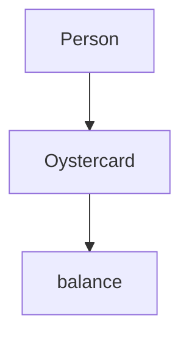
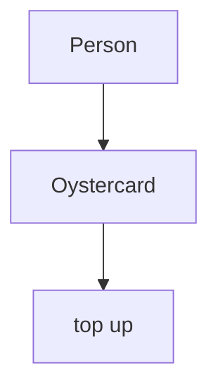
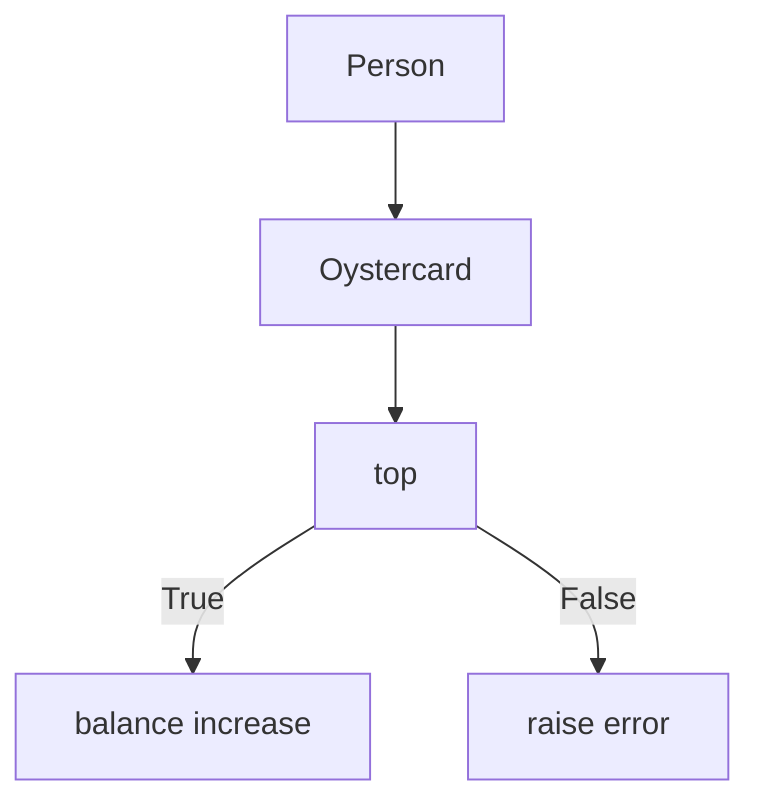

## Getting started

1) git clone path-to-repo
2) Install bundler via `gem install bundle` (if you don't have bundler already)
3) Install dependencies via `bundle`

## Test Code

Run rspec from the main directory to test the code and check coverage

## Run

Run code using irb

`require './lib/airport'`
`require './lib/plane'`

## User Stories, Domain Models and Mermaid Diagrams

`In order to use public transport
As a customer
I want money on my card`

|  Objects        |  Messages      |
| ----------      | -------------  | 
| Person  |                        |
| Oystercard  |      balance    |

`In order to keep using public transport
As a customer
I want to add money to my card`

|  Objects        |  Messages      |
| ----------      | -------------  | 
| Person  |                        |
| Oystercard  |      top up    |

`In order to protect my money from theft or loss
As a customer
I want a maximum limit (of £90) on my card

|  Objects        |  Messages      |
| ----------      | -------------  | 
| Person  |                        |
| Oystercard  |      top up   |

